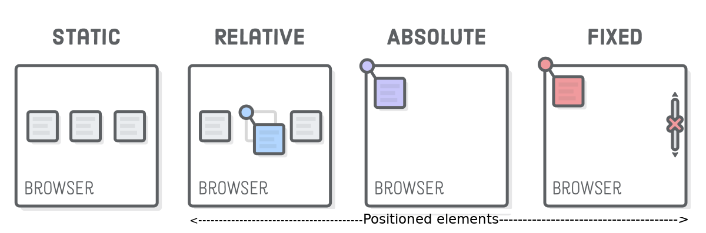
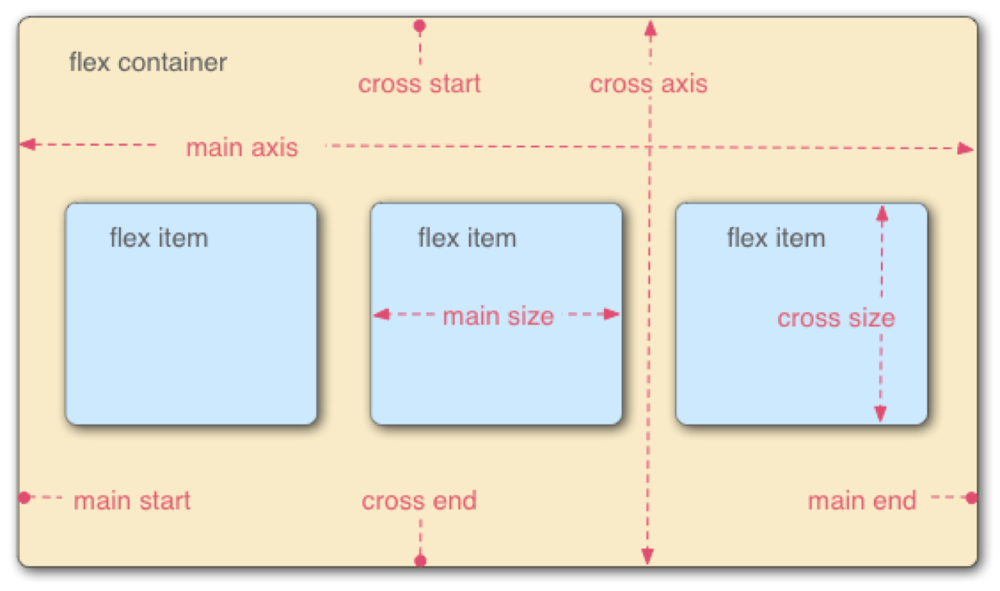

# Cascading Style Sheets
Cascading Style Sheets (CSS), defines the outlook of HTML by specifying properties, such as colors, sizes, position, etc.

## Methods to load CSS
- Inline style: style attribute inside an element. This method is good for debugging not production.
- Internal style: a separate `<style>` element inside the document.
- External style file: a separate CSS file that is linked to the HTML document with a <link> element. This method is recommended in the production. The reusability wins the preference.

## CSS selector

The CSS selectors module defines the patterns to select elements to which a set of CSS rules are then applied along with their specificity. The CSS selectors module provides us with more than 60 selectors and five combinators. Other modules provide additional pseudo-class selectors and pseudo-elements.

In CSS, selectors are patterns used to match, or select, the elements you want to style. Selectors are also used in JavaScript to enable selecting the DOM nodes to return as a NodeList.

Selectors, whether used in CSS or JavaScript, enable targeting HTML elements based on their type, attributes, current states, and even position in the DOM. Combinators allow you to be more precise when selecting elements by enabling selecting elements based on their relationship to other elements.

### Simple selector
The most commonly used selectors in CSS are class, id, and tag.

- Select all elements
```CSS
* {
    color: black;
}
```

- Select elements by class
```CSS
.class_name {
    font-family: serif;
    color: #0000FF;
}
```

- Select elements by id
```CSS
#element_id {
    font-family: serif;
    color: #0000FF;
}
```

- Select elements by tag
```CSS
p {
    font-family: serif;
    color: #0000FF;
}
```

- Select elements by attribute
The CSS attribute selector matches elements based on the element having a given attribute explicitly set, with options for defining an attribute value or substring value match.

```CSS
/* <a> elements with a title attribute */
a[title] {
  color: purple;
}

/* <a> elements with an href matching "https://example.org" */
a[href="https://example.org"]
{
  color: green;
}

/* <a> elements with an href containing "example" */
a[href*="example"] {
  font-size: 2em;
}

/* <a> elements with an href ending ".org", case-insensitive */
a[href$=".org" i] {
  font-style: italic;
}

/* <a> elements whose class attribute contains the word "logo" */
a[class~="logo"] {
  padding: 2px;
}

```
(Reference: [Attribute selectors](https://developer.mozilla.org/en-US/docs/Web/CSS/Attribute_selectors) )

- Selector chain
For example, dot-concatenated classes target elements having all the listed classes defined:

```html
<style>
p.old.python_code { text-decoration:line-through; }
</style>

<p class="old python_code">print "Hello world!"</p> <!-- affected -->
<p class="new python_code"> print("Hello world!")</p> <!-- not affected -->
```

### Combinators
You may combine the CSS selector with some logic.

- Descendant combinator (" ") selects all elements contained inside the parent.

```CSS
/* All li elements inside element with "important" id */
#important li { font-weight: bold; }
```

- Child combinator (">") select immidiate children of the parent element.
```CSS
/* All h2 that are immediate children of element with id of content */
#content > h2 { font-weight: bold; }
```

- Sibling combinator ("~") selects any elements that share the same parent after the first selector.

```CSS
/* Any p that share the same h1 parent with h1 that are after h1 */
h1 ~ p { font-weight: bold; }
```

- Next sibling combinator ("+") selects the element which is immediately after the defined sibling.

```CSS
/* Selects p elements that are immediately after h1 */
h1 + p { font-weight: bold; }
```

### Pseudo-elements

Pseudo-elements may be appended to a selector. They affect specific parts of the elements in target, that is, p::first-line will affect the first lines of paragraphs. In CSS3, double colons ("::") are used to distinguish pseudo-elements from pseudo-classes (":").

The pseudo-elements are: 

```
::first-letter
::first-line
::after
::before
```

::after and ::before pseudo-elements fit well with the content property. A content property can be used to insert new content into a page in combination with pseudo-elements: [example](https://developer.mozilla.org/en-US/docs/Web/CSS/::before)

### Pseudo-classes
Pseudo-classes affect elements with a specific state, for example, a link is hovered by the pointer, :hover

```
/* this link changes color when the mouse is over it */
a.special_link:hover { background-color: white; }
```

Some selected pseudo-classes are:

- :active - e.g., element has focus
- :visited - e.g., this link has been clicked before
- :hover - e.g., mouse cursor is currently over this element
- :enabled - e.g., this input element is not disabled
- :first-child - e.g., first child element of this element
- :nth-child(aN+b) - an order number or formula, e.g., 4N = every fourth

### Let's rock with the game to sharp our CSS selector knowledge
[CSS Diner](https://flukeout.github.io/)


## What does cascading and specificity mean?


There are a few rules to solving style conflicts:

- Specificity: selectors have a certain specificity value. The rule with the most specific selector "wins"
- Cascading (location): when several rules have the same specificity value, the rule that was specified "last" wins
- Inheritance: some properties are inherited from their parent. But not all.

### Specificity formula
When multiple styles overlap, the ascending order of specificity defines the end result (the strongest last):

| Selector Type                              | Specificity |
|--------------------------------------------|-------------|
| Type Selector, Pseudo-element Selectors    | 1           |
| Class Selector, Pseudo-class, Attribute Selector | 10      |
| ID Selector                                | 100         |
| Inline Style Attributes                    | 1000        |

The specificity is a sum of the specificity values. For example:

```
p::after                 //1(type)+1(pseudo-element) = 2
[type=email]             //10(attrib. selector)      = 10
p.important              //1(type)+10(class)         = 11
aside.chart:first-child  //1 + 10 + 10               = 21
```

*!important* overrides the cascading properties. To be used if no better way exists. For example, in the case of an external CSS, which you cannot control.

### Cascading order

| Origin                                    | Importance (the strongest last) |
|-------------------------------------------|---------------------------------|
| user agent (same as browser defaults)    | normal                          |
| user agent                               | !important                      |
| user                                     | normal                          |
| author                                   | normal                          |
| CSS Animations                           | refer to [Cascading order](https://developer.mozilla.org/en-US/docs/Web/CSS/Cascade#cascading_order)         |
| author                                   | !important                      |
| user                                     | !important                      |

In case of equal specificity, the latest declaration applies.

### Inherit

*inherit* value in declarations means that the value is the same as it is in the parent element.

*inherit* is an allowed value for every CSS property.

### !important

All the rules previously assigned to an element can be overridden by writing *!important* after a rule. This is to be used in special situations only. For example, visually impaired users may write a rule in the user style sheet (browser file userContent.css)

```CSS
body { 
  font-size: large; !important 
}
```

Because of this, it should not be used as a quick workaround, even if tempted to do so.

## Box model

Every element in an HTML document is represented as a box that has four edges: content edge, padding edge, border edge, and margin edge.

In the box model, the children try to be as wide as the parent allows them to be, while the parent element aims for a minimum height that fits all children.

### Margin

Margins are always transparent. __Horizontal margins don't overlap (collapse), while vertical (top and bottom) margins can collapse.__ For example, we have two elements, the first has a margin on the bottom 10px and the other has a margin on the top of 5px. The first instinct might be, that the margin between these two elements is 15px. However, the vertical margin collapses, resulting in a margin of only 10px.

```html
<style>
    h2 { margin-bottom: 10px; }
    p { margin-top: 5px;}
</style>

<h2>Collapsing Margins</h2>
<p>The margin between this paragraphs and
the heading above would be 10 pixels, not 15.</p>
```

Code snippet, define the margin, border and padding

```CSS
/* 5px all around */
margin: 5px;
/* 5px on [top,right,bottom,left], no changes for others */
margin-top: 5px;
/* 10px for the top and bottom, 1px for right and left */
margin: 10px 1px; 
/* 5px for the top, 4px for the left and right, 3px for the bottom */
margin: 5px 4px 3px; 
/* 1px for the top, 2px for the right, 3px for the bottom, and 4px for the left margin */
margin: 1px 2px 3px 4px; 
/* 5px top and bottom, horizontally center the element within its container (assuming a width is also set) */
margin: 5px auto; 

border: 3px solid #FF0000;
```

## Position on the page
The _normal flow_ is implemented if the position or display is not declared. The content flows from left to right and from up to down.

### Inline & block
In the HTML lecture, we learned the two groups of the html elements, inline (e.g., span, image, a), block (e.g., div, p).

Inline elements, such as `<span>` and `<a>`, occupy only the space needed and flow like the text from left to right without generating line breaks.

Block elements, such as `<div>` and `<p>`, inhabit the entire width of their parent element. Typically, there is a new line inserted before and after them. Height can be set also as more or less than the elements occupy. If the height of the element is set as less than the height of its content, overflow occurs. Overflow can be controlled using the overflow property (e.g., hide overflow, allow content to exceed container, show scrollbars).

Elements can be changed from inline to block and vice versa with the display declarations.
```
/* Would insert line breaks before and
after links with the class menu_item */
a.menu_item { display: block; }
```

### Position


### Z-index
When location (in x, y) is forced, elements may overlap.

In these scenarios, the z-index tells how the elements should be layered, that is, which is on top, and which is below which - the greater the number, the nearer to the user the element is. The z-index must be an integer, but it can also be negative. With equal z-indices, the latest is the foremost, that is, the element that comes last in the HTML.

static implies a z-index of zero, other positions are z-index of one.

### Floats
_float_ is a common declaration to position images besides text, that is, to make the text flow around the image on either side. Together with float, comes also clear, which can be used to force the flowing content to start only after the float has ended.

```
float: left|right|none;
clear: left|right|both;
```

## Flexbox
Flexbox is a display declaration, that allows for easier implementation of flexible layout. Elements are laid out within their parent flex container, that is, an element with display: flex. In flexbox-land, the elements can be placed in both horizontal and vertical directions. These are referenced as the main axis and the cross axis, while the direction can be changed using flex-direction.



To learn this concept, let's play this game, [FLEXBOX FROGGY](https://flexboxfroggy.com/)

## Grid
grid is another handy display declaration for creating layouts. Flexbox defines layouts in 1D, while grid defines them in 2D. Both are very capable of solving many issues difficult in CSS2. As with flexbox, you start by creating a grid container with display: grid; to contain grid items.

To learn this concept, let's play this game, [GRID GARDEN](https://cssgridgarden.com/)