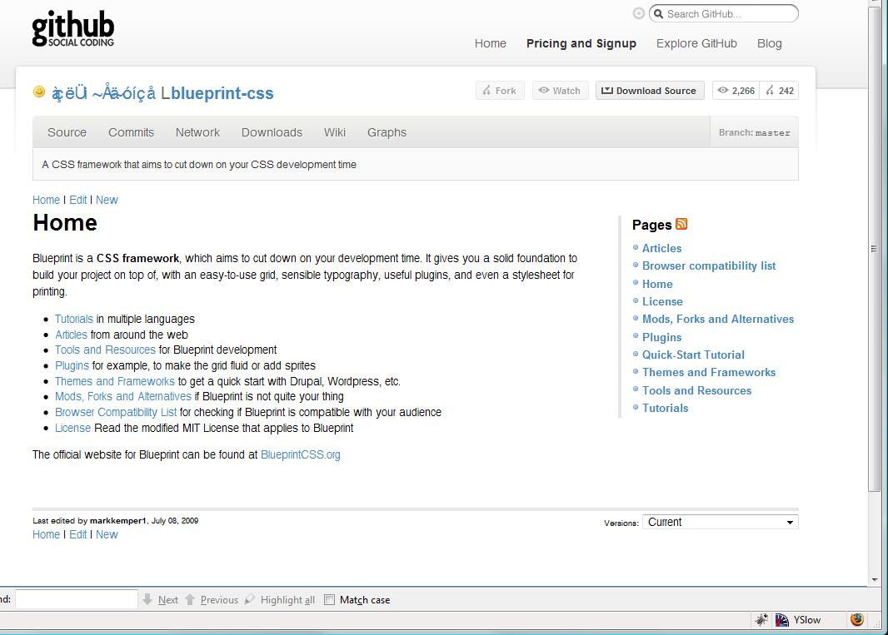

# HTML - The document structure and content
HTML is an abbreviation of HyperText Markup Language. It is used to convey the semantic structure and meaning of the content.

## HTML document structure
This section describes the HTML document structure.

### HTML document type declaration
HTML documents always start with a doctype definition. The HTML standard evolved from the draft to the version 5 (latest).
| HTML Version | Document Type Declaration |
|--------------|---------------------------|
| HTML5        | `<!DOCTYPE html>`         |
| HTML4 Strict | `<!DOCTYPE HTML PUBLIC -//W3C//DTD HTML 4.01//EN" "http://www.w3.org/TR/html4/strict.dtd">` |
| HTML4 Transitional | `<!DOCTYPE HTML PUBLIC "-//W3C//DTD HTML 4.01 Transitional//EN" "http://www.w3.org/TR/html4/loose.dtd">` |
| HTML4 Frameset | 

### HTML character encoding
Have you seen the garbled web page like this, . In most of the cases, this incorrect encoding causes the garbled page.

Please read this article, 
https://www.joelonsoftware.com/2003/10/08/the-absolute-minimum-every-software-developer-absolutely-positively-must-know-about-unicode-and-character-sets-no-excuses/

### Valid HTML
The HTML standard defines syntax and grammar. HTML is modeled based on XML, which is a similar-looking, tag and attribute-based syntax, but HTML is much less strict than XML.

You may use the online validator to verify your HTML file, [HTML validator](http://validator.w3.org)

### Element
Void element and self-closing: [To close or not to close](https://medium.com/hackernoon/to-close-or-not-to-close-4365d24853ff)

### Nesting
The nesting means elements inside other elements. Nesting is what creates the tree-like structure we call DOM - The Document Object Model (more on this later) and it starts almost right away with the `<html>` tag having the `<head>` and `<body>` nested within it.

Nesting has strict rules:

- elements should be correctly nested:
    - parents are placed within roots
    - children are placed within parents
- some elements must not contain other elements
    - for example, a link (`<a>`) must not nest any other links inside its content

### Attributes
- global
    - id and class are the main hooks for CSS to target the element or collection of elements. They can be used globally in all tags. id identifies a single element on the whole document - there should never be two elements with the same id. class is used to target a group of elements - you can use the same class for as many elements of any type as needed.
- local
    - Local attributes are specific for a tag, such as the type of an input element. These are tag-specific - a heading element cannot have attributes related to form submission, for example.

### Element - links
The `<a>` tag has a special attribute, target, which can be used to specify how the link should be opened: `<a target="_blank|_self|_parent|_top|framename">`.

| Target Value | Behavior                                                   |
|--------------|------------------------------------------------------------|
| _blank       | The link is opened in a new window or tab                  |
| _self        | The link is opened in the same frame as it was clicked     |
| _parent      | The link is opened in the parent frame                     |
| _top         | The link is opened in the full body of the window          |
| framename    | The link is opened in the named iframe                     |

Normally, the target attribute can be omitted and only reached for in specific scenarios. This allows the user to choose whether they want to follow the link or to open multiple links to new tabs in the background. Having said that links that result in downloading a document should (in my opinion) have target _blank, as sometimes pdf readers make it difficult to return to the previous page.

### Element - forms
Forms are used to send data from a browser to a server. Currently, `<form>` elements can only perform either GET or POST requests, hence they are most usable for the visitors of a webpage - a developer will most often communicate with the server via XHR (XMLHttpRequest) to be able to use all the HTTP verbs.

The communication happens via HTTP - HyperText Transfer Protocol.
```html
<form action="/scripts/add_contact" method="POST">
    <p>First name: <input type="text" name="first-name"></p>
    <p>Surname: <input type="text" name="surname"></p>
    <input type="submit" value="Add">
</form>
```
This example would perform a POST request to /scripts/add_contact when the button with the label Add was pressed, sending us the request body the names and values of the input fields as key-value -pairs.

A good blog: [Dive into HTML5 form](http://diveintohtml5.info/forms.html)
