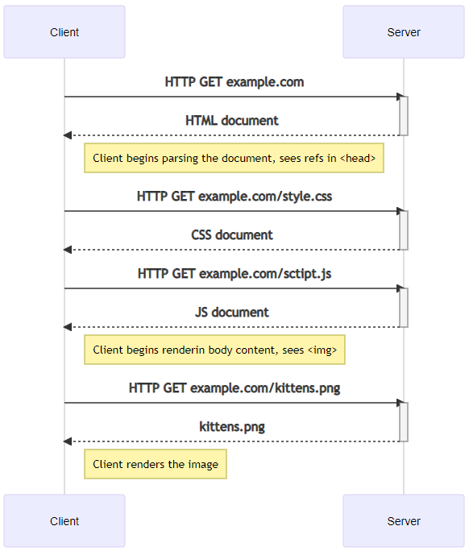

# HyperText Transfer Protocol - HTTP
HTTP refers to HyperText Transfer Protocol. It is one of the protocol on the 7th level of the OSI model. The HTTP defines how the data exchange on the Web.

## Client - Server model
The client-server model means that we have some client initiating requests for some server. Usually, this client, known as the user-agent, is a Web browser (Chrome, Firefox, Opera, Edge, etc.), but it can be any tool acting on the users behalf (e.g., CURL, Postman). These components, the client and the server, communicate by exchanging individual messages (as opposed to a stream of data, for example).

When a client sends a message to the server, it is known as a request and when the server send a message as an answer, it is called a response. This pair of one request + one response is known as a transaction. Once the server has answered to a request with a response, the transaction is complete and any further communication between the client and the server require a new transaction.

### HTTP exmaple
HTTP request example:
```
GET / HTTP/1.1
    Host: net.centria.fi
    Accept-Language: fi
```
| Method | Path | Protocol Version | Headers |
|--------|------|------------------|---------|
| GET    | /    | HTTP/1.1         | Host: net.centria.fi, Accept-Language: fi |


HTTP response example:
```
HTTP/1.1 200 OK
    Date: Sat, 09 Oct 2010 14:28:02 GMT
    Server: Apache
    Last-Modified: Tue, 01 Dec 2009 20:18:22 GMT
    ETag: "51142bc1-7449-479b075b2891b"
    Accept-Ranges: bytes
    Content-Length: 29769
    Content-Type: text/html

    <!DOCTYPE html... (here come the 29769 bytes of the requested web page)
```
| Status | Status Code | Protocol Version | Headers |
|--------|------|------------------|---------|
| OK    | 200   | HTTP/1.1         | Date: Sat, 09 Oct 2010 14:28:02 GMT |
||||Server: Apache|
||||Last-Modified: Tue, 01 Dec 2009 20:18:22 GMT|
||||ETag: "51142bc1-7449-479b075b2891b"|
||||Accept-Ranges: bytes|
||||Content-Length: 29769|
||||Content-Type: text/html |

### How website works with HTTP
A typical website request might consist of first requesting the URL, for example, GET example.com, to which the server might typically be configured to respond with a file called index.html. The browser then starts reading the HTML and might come along with references to a CSS style definition file and a JavaScript file in the <head> section of the HTML document. The browser then needs to make further GET requests to obtain those files. The browser proceeds to render the markup on the screen but comes along with an  tag. Yet another GET request needs to be performed to obtain that image, during which the HTML document is shown rendered, only without the image. Even so, that if the dimensions of the expected image file are not specified in the HTML, the browser does not know how much empty space to leave for that image, thus causing the flow of the document to change each time an image finishes loading.

This process is roughly outlined in the chart below:



The example above is the traditional, old-school paradigm of a server-rendered website. In this scenario, the client is dumb - it receives the HTML from the server and displays it to the user. The HTTP interaction on the client side is restricted to at most clicking on a link, which then causes the browser to perform a GET request or to POST a form. If you were to view the files in the filesystem, they might look like something like this:
```
Mode                 LastWriteTime         Length Name
----                 -------------         ------ ----
-a---l        26.10.2021     14.13            960 about.html
-a----        26.10.2021     14.13            120 contact.html
-a---l        26.10.2021     14.13             70 index.html


$\var\www\html>
```
And if you would open the index.html in a text editor (or clicked on the "view source" option in the browser) it might have looked something like this:
```
<!DOCTYPE html>
<html lang="en">
<head>
    <meta charset="UTF-8">
    <title>Welcome to my website</title>
    <link rel="stylesheet" href="style.css">
    <script src="script.js"></script>
</head>
<body>
    <p>Here's some kittens
        
    </p>
    <p>
      <a href="about.html">About us</a> | 
      <a href="contact.html">Contact us</a>
    </p>
</body>
</html>
```

## HTTP methods

| Method | Description                                                                                           | Safe    | Idempotent | Cacheable |
|--------|-------------------------------------------------------------------------------------------------------|---------|------------|-----------|
| GET    | Requests a representation of the specified resource. Should only retrieve data.                       | Yes     | Yes        | Yes       |
| HEAD   | Asks for a response identical to a GET request, but without the response body.                         | Yes     | Yes        | Yes       |
| POST   | Submits an entity to the specified resource, often causing a change in state or side effects on the server. | No      | No         | Depends   |
| PUT    | Replaces all current representations of the target resource with the request payload.                 | No      | Yes        | No        |
| DELETE | Deletes the specified resource.                                                                       | No      | Yes        | No        |
| CONNECT| Establishes a tunnel to the server identified by the target resource.                                   | No      | No         | No        |
| OPTIONS| Describes the communication options for the target resource.                                           | Yes     | Yes        | Yes       |
| TRACE  | Performs a message loop-back test along the path to the target resource.                                | Yes     | Yes        | No        |
| PATCH  | Applies partial modifications to a resource.                                                           | No      | No         | Depends   |

There are safe methods GET and HEAD: these will fetch some data and, importantly, will not have any side effects on the server. If I can delete a resource from your server with a GET request, you are doing something fundamentally wrong and dangerous. GET is the method that the browser makes when following normal links and when opening an URL.

Idempotent methods will always result in the same side effects even if executed single or multiple times. Safe methods are also idempotent, but not all idempotent methods are safe methods: idempotent methods also include PUT and DELETE, which are not safe.

GET is safe and idempotent. You can refresh the Google front page multiple times without any change in the server (except perhaps some logging and user tracking). POST is not safe, nor idempotent:
```
POST /chat HTTP/1.1
  message=hello

POST /chat HTTP/1.1
  message=hello

POST /chat HTTP/1.1
  message=hello
```
This should result in changes in the server (i.e., not safe) as well as there being three of them (i.e., not idempotent).

DELETE is idempotent but not safe, even if the returned status code may change between requests: once you delete a specific resource, you cannot delete that same resource again.
```
DELETE /messages/1 HTTP/1.1   -> Returns 200 OK if the resource existed
DELETE /messages/1 HTTP/1.1   -> Returns 404 Not Found, as it just got deleted
DELETE /messages/1 HTTP/1.1   -> Returns 404 Not Found
```
In the browser context you are limited to just GET (links, linked resources, such as images, forms) and POST (forms), but with JavaScript you can perform all of the methods.

### HTTP Status code
| Response Code | Response Family             |
|---------------|-----------------------------|
| 1xx           | Informational responses     |
| 2xx           | Success responses           |
| 3xx           | Redirect responses          |
| 4xx           | Client errors               |
| 5xx           | Server errors               |

## Statelessness
Transactions are individual. Nothing ties two transactions together. Further, they are stateless - preceding events or interactions are not remembered! Each request from the client to server must contain all the information necessary to understand the request. The requests cannot take advantage of any stored context on the server. Session state is kept entirely on the client.

Let's say you have a button on a website and you wonder how you can call a method on the server when the button is clicked. In HTTP you can't. The server application has stopped responding to your request and that execution cannot be reached anymore. Only thing you can do is to make another request.

Statelessness improves visibility, reliability, and scalability. Visibility is improved since a single request shows the full nature of the request. Reliability is improved since it makes it easier to recover from partial failures. And scalability is improved since resources can be quickly freed because of no state between requests. Further, implementation is simplified, as the server does not have to manage resource usage across requests.

On the other hand, statelessness may decrease network performance, as it increases the repetitive data sent in a series of requests. It also reduces the server's control over consistent application behavior - the application is dependent on the correct implementation of semantics across multiple client versions.

Having said all this, applications often need to use states internally. For example, a shopping basket needs to hold items when the page changes and login details are not sent for each page load. The browser does not send an identifier automatically - this needs to be taken into account when creating applications.

To tie two requests together as a session, we need an identifier included in both requests. Something that can be used to pick those two requests out of all incoming requests and say these two requests are coming from the same user. There are several ways to do this. Some are better than others. We could add an identifier manually. Perhaps a query string parameter, such as index.php?session=XYZ123B? Or a hidden input field in forms, such as <input type="hidden" name="session" value="XYZ123B">? This would be needed for each request. So, not very convenient and not very secure. The first example used query string parameters that are sent using a normal GET requests. This means that the value is visible on the address bar and in the network traffic. An attacker would only need to see the value and append it to their request to be able to impersonate as the victim. The latter example could be done using POST requests, as forms are able to perform both GET and POST requests. In a POST request, the value would not be visible on the address bar but rather travel in the request body (which is not possible with GET requests). Still, this would limit us to only make POST requests, which goes against the REST principles. Not to mention the need to turn every link into a form.

Luckily, the issue has been resolved using cookies. But before we can properly understand cookies, we must first take a look at HTTP headers. And we'll do that by first writing our own server.