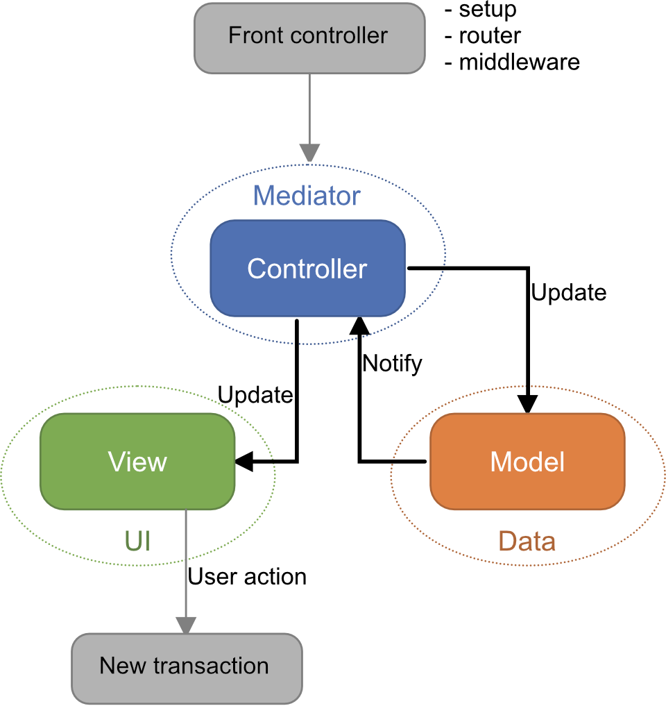
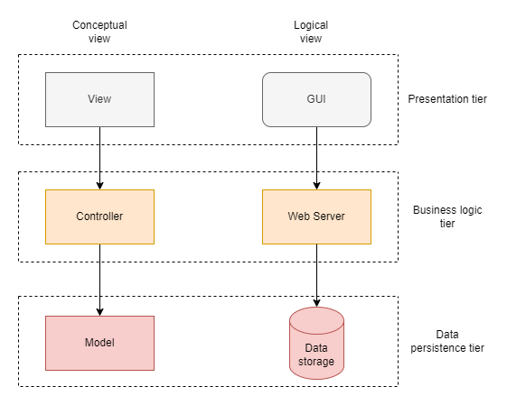

# Web architecture

## MVC pattern
The MVC pattern is quite common in GUI software. In there, the view component could communicate user interaction directly to the controller, which, of course, is not possible using HTTP.

The MVC pattern is most suitable for server-rendered web applications. If a lot of the logic is handeled on the client-side, the server architecture consist of the controller and the model, while the view is constructed on the client-side. This will most likely force the view component to take some of the roles of the controller.

| View                                            | Controller                                    | Model                                          |
|-------------------------------------------------|-----------------------------------------------|------------------------------------------------|
| Presents the UI.                               | Handles user interactions and manipulates the model. | Manages data.                                  |
| Provides an interface for interacting with the system. | Controls the application logic on a higher level. | Stores and retrieves data from a database.     |
| Often reflects the model of the application.   | Reveals how the application works.            | Has no knowledge of what the application is for. |
| Displays this information in a view-specific way. | The brains of the application.                | Has no knowledge of how the data is shown to the user. |
| Only responsible for displaying info.           |                                               | The controller can send a request to the model. |
| However, may contain some application logic.   |                                               | The model is responsible for executing that request. |
| Receives updates from the controller about the model. |                                               |                                                |

## Web application architecture
The web application in this demo is using three-tier achitecture, presentation tier, logic tier and data persistence tier.

