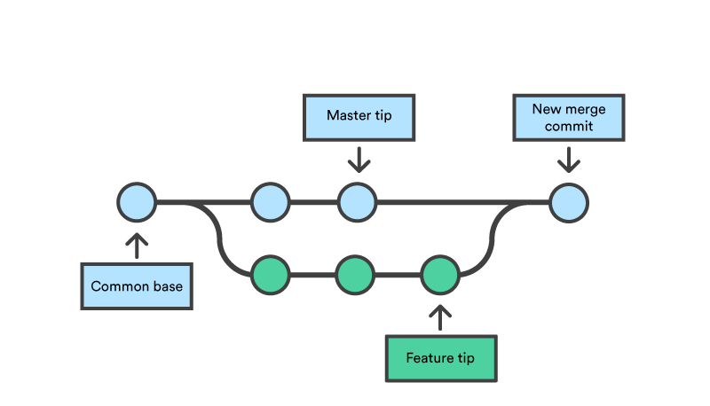

# Tools in the course
Here lists the tools used in the course.
## Git version control system
Have you encountered the following scenarios,
1. When you work on a project, have you seen the similar file list in your project?
```
$ cd www
$ ls

    May 15 20:24 index_old.html
    Jul 14 23:10 index_Add_Title.html
    Jul 14 22:44 index_Add_Title_OLD.html
    Sep 12 09:44 index_Add_Title_2.html
    Oct 14 22:44 index_html_FINAL.html
    Nov 15 16:10 index_html_draft_FINAL.html
```

2. When you work in pairs or a team, have you sent the following message to the others?

*"Could you send me the files you worked on, I can put them together."*

These are just some, not all, scenarios that a version control system can fit. One of the more popular version control systems is Git, although many others exist. Git can be downloaded for free from http://git-scm.com/. It is a line-based version control system. That means that if one character is changed on one line, that one line is considered altered. This makes it effective even when using large files.

You can learn a lot more about version control and Git by reading the ebook on the Git homepage. Sections 2.2 - 2.5 of the said book cover most of what is needed on this course.

GitHub is an online service for hosting your Git repository. GitHub is free for open source projects. Building engineer's career profile with open source project through GitHub is highly evaluted when applying jobs, especially for the students. Therefore, GitHub is selected to use in the course for the students to submit the assignments. If you have not used GitHub, you definitely should register an account in GitHub and start to use it. You may follow this [instruction](https://docs.github.com/en/get-started/start-your-journey/hello-world) to learn GitHub.

### Git workflow
So, let's imagine you need to make a change to some file in a remote repo, be that in GitHub or some other service, the workflow might look something like this:

```bash
// Clone the remote repo
git clone git:URL

// Make changes to some file
// ...
// pull possible changes from the remote repo 
// in case someone has made changes there during your coding session
git pull

// Add the file you edited to the staging area
git add FILE_NAME;

// Commit your changes to your local copy of the repo
git commit -m "DESCRIPTION" FILE_NAME;

// Push the changes to the remote repo
git push;
```

### Merge conflicts
When working alone, you do not need to collaborate. But if multiple people are working on the same project, it is highly possible that more than one person makes a change on the same line of the same file. Remember that Git is line-based? This means that more than one person can edit the same file at the same time, even adding or removing lines, without any problems as long as they do not edit the same line. But what happens when they do edit the same line at the same time? Let's imagine two people pull code from online repo to their computers. They both proceed to edit file.txt and make a change to the first line. Person A pushes the changes to the remote repo. A merge conflict can occur when person B pulls before pushing their changes or when person B pushes their changes without first pulling. Either way, the conflicted file looks like a mess:
```
$ cat file.txt
<<<<<<< HEAD
This is person B's brand new first line
=======
This is person A's totally awesome first line
>>>>>>> new_branch_to_merge_later
```

There are two conflict lines marked up and can choose which to keep. That extra markup is just text, it is a old school style originally from Linux realm. You can remove it by hand when you have chosen which line to keep.  But many editors also detect that extra markup and can offer tools for accepting current change, accepting incoming change, etc.

### Branches
Branches are a good way not to break existing functionality when implementing more, for example. You can leave one branch of the code to be at a state you deem acceptable and begin working on a new feature on a separate branch without worry that in the end, you are left with no working code at all. Also, the other branch, let's call it main, can be coded further simultaneously. If the feature is a bust, you can delete that branch and return to main. But if the feature is completed and deemed suitable, it can be merged into the main branch.


You can create new branches with the command git checkout -b BRANCH_NAME. The new branch will be the one left open. You can push branches to the remote repo with git push origin BRANCH_NAME. And you can list all branches with git branch -a.

So, you have checked out a branch for a feature and merrily coded away. Now, how do you merge the new branch back to the main branch? Well, you first need to check out the main branch (the branch to which you want the new code) with git checkout main and then merge the other branch onto main with git merge BRANCH_NAME main.